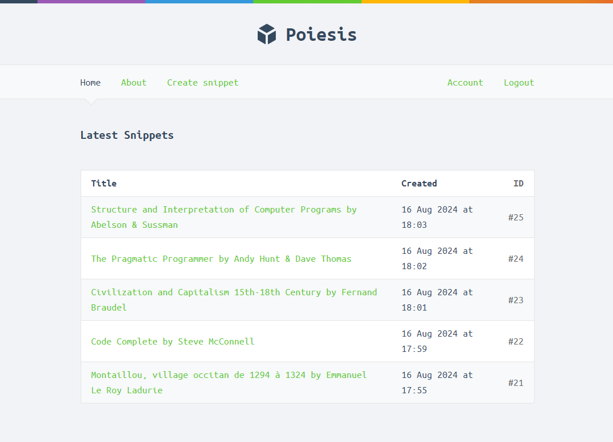

<h1 align="center">Poiesis</h1>

  <strong>Poiesis</strong> is a web application designed for capturing and organizing your snippets of text in a linear way.

  
  

<h2>Screenshots</h2>

  

<h2>Features</h2>
<ul>
  <li><strong>User Authentication:</strong> Secure signup, login, and session management, including password recovery and password change functionality.</li>
  <li><strong>Snippet Management:</strong> Create, view, and manage text snippets with expiration options (1 day, 7 days, or 1 year).</li>
  <li><strong>Responsive Design:</strong> Fully responsive design using modern HTML and CSS, ensuring compatibility with various devices.</li>
  <li><strong>Secure Web Server:</strong> TLS configuration for secure HTTPS connections, ensuring the protection of user data.</li>
  <li><strong>Middleware:</strong>
    <ul>
      <li><strong>Logging:</strong> Detailed request logging for better monitoring and troubleshooting.</li>
      <li><strong>Security Headers:</strong> Implementation of security headers like Content-Security-Policy, X-Frame-Options, and others to prevent common web vulnerabilities.</li>
      <li><strong>CSRF Protection:</strong> Integrated CSRF protection using nosurf to safeguard against cross-site request forgery.</li>
      <li><strong>Template Rendering:</strong> Dynamic HTML template rendering with Go’s html/template package, including custom functions like date formatting.</li>
    </ul>
  </li>
  <li><strong>Database Integration:</strong> Persistent storage using MySQL with efficient SQL queries for data retrieval and manipulation.</li>
  <li><strong>Flash Messages:</strong> User-friendly flash messages to notify users of successful actions or errors.</li>
  <li><strong>Session Management:</strong> Session management using scs with MySQL store, including session renewal on login to prevent session fixation attacks.</li>
  <li><strong>Testing:</strong> Comprehensive unit and integration tests covering core functionalities.</li>
  <li><strong>Rate Limiting:</strong> Basic rate limiting to prevent abuse and ensure fair usage.</li>
  <li><strong>Form Validation:</strong> Extensive form validation using a custom validator package, ensuring data integrity and providing meaningful error messages.</li>
  <li><strong>Error Handling:</strong> Robust error handling with user-friendly error pages and server-side logging of stack traces.</li>
  <li><strong>Static File Serving:</strong> Efficient serving of static assets like CSS, JavaScript, and images from a secure, read-only file system.</li>
</ul>

<h2>Installation</h2>
<ol>
  <li>Clone the repository: <code>git clone https://github.com/interimme/poiesis.git</code></li>
  <li>Navigate to the project directory: <code>cd poiesis</code></li>
  <li>Install dependencies: <code>go mod tidy</code></li>
  <li>Run the application: <code>go run ./cmd/web</code></li>
</ol>

<h2>Usage</h2>

Once the application is running, you can access it via <code>http://localhost:4000</code>. From there, you can create and manage text snippets, sign up for an account, and explore other features.

<h2>Contributing</h2>

Contributions are welcome! Please fork this repository, make your changes, and submit a pull request.

<h2>License</h2>

This project is licensed under the MIT License. See the <a href="LICENSE">LICENSE</a> file for more details.

